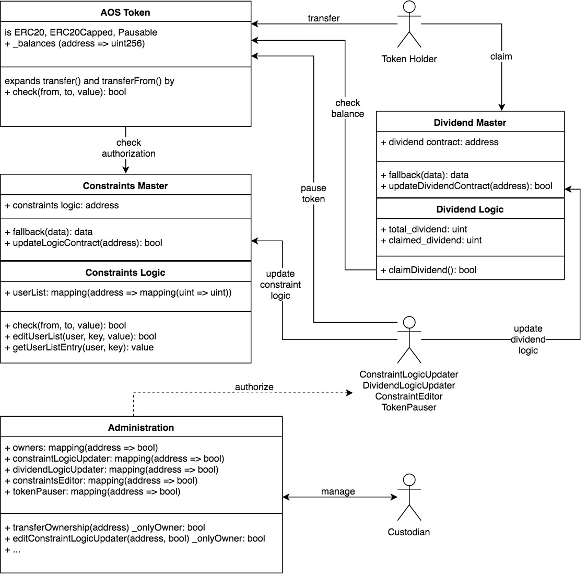
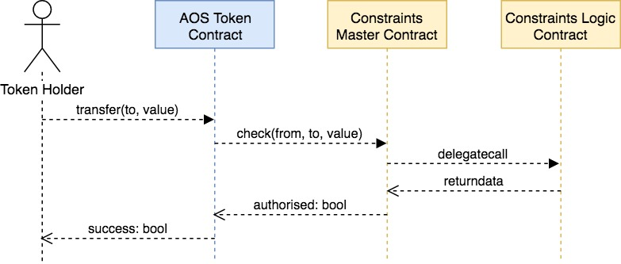

### Azhos Smart Contracts

#### Components

There are 4 main components:

1. _AOS Token Contract_  
2. _Constraint Logic Contract_ (CLC)  
3. _Dividend Contract_         (DC)  
4. _Administration Contract_

##

   CLC and CD will both be made **updatable** through the use of proxy contracts.  
   This means that their storage memory will persist when new versions are deployed.
   
##

The Administration contract will assign addresses with one or more of these **abilities**:

- **update** CLC and DC
- **pause** AOS Token Contract
- **edit constraints** in CLC (such as whitelist etc)

#
#### Architecture

#
#### Process Flows

We have 6 different possible interaction processes:  

**User Interaction**  
    1. transfer AOS token  
    2. claim dividend 
 
**Updates**  
    3. update CLC   
    4. update DC

**Admin**  
    5. transfer admin ownership  
    6. edit authorized addresses

#
##### 1. transfer AOS token

Every token transferring action triggers a call to the _check()_ function in the CLC, which is routed through the proxy contract (here Master Contract)

#
##### 2. claim dividend

#
##### 3. update constraints logic contract

#
##### 4. update dividend contract

Updating the dividend contract includes providing the new contract with enough funds to satisfy all token holders' claims.

#
##### 5. transfer admin ownership

#
##### 6. edit authorized addresses

   

