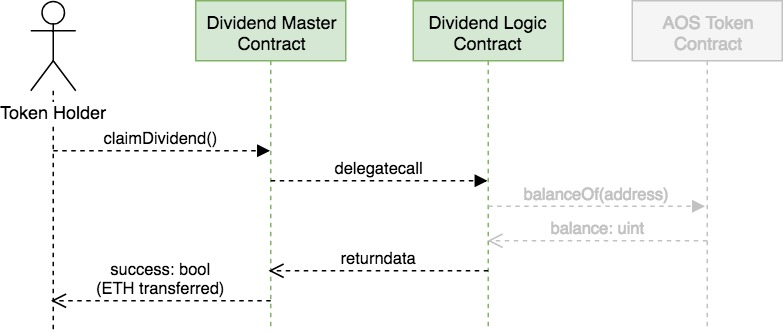
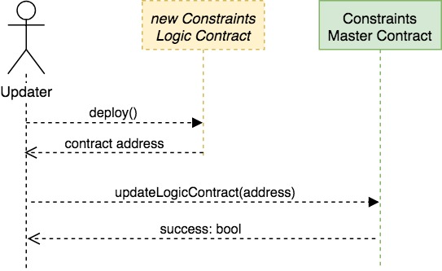

## Azhos Smart Contracts

### Components

There are 4 main components:

1. _AOS Token Contract_  
2. _Constraint Logic Contract_ (CLC)  
3. _Dividend Contract_         (DC)  
4. _Administration Contract_

##

   CLC and CD will both be made **updatable** through the use of proxy contracts.  
   This means that their storage data will persist when new versions are deployed.
   
##

The Administration contract can endow addresses with one or more of these **abilities**:

- **update** CLC or DC
- **pause** AOS Token Contract
- **edit constraints** in CLC (such as whitelist etc)


#
### Architecture


#
### Updatable contracts

The contracts we call _logic_ contracts are treated as Solidity [_libraries_](https://solidity.readthedocs.io/en/latest/contracts.html?#libraries).  
This means that they are exclusively used to perform tasks for other contracts, in this case the _master_ contracts.  

Even though the master contract (proxy) does not contain any of the variable definitions or functions,  
it assumes these as its own when using "delegatecall" to use our library/logic contract.  

So i.e. the _userList_ mapping is actually saved in the master contract's storage and we are using the logic contract's functions to alter it.

This gives us the ability to update the logic contract whenever we want!  

**But, the new contract has to inherit the old one**, so that the old storage variables will not be changed.


#
### Process Flows

We can identify 7 main interactions:  

**User Interaction**  
    1. transfer AOS token  
    2. claim dividend 
 
**Updates**  
    3. update CLC   
    4. update DC

**Admin**  
    5. transfer admin ownership  
    6. edit authorized addresses  
    7. edit userList (i.e. whitelist)

##
#### 1. transfer AOS token

Every token transferring action triggers a call to the _check()_ function in the CLC, which is routed through the proxy contract (here Master Contract)


##
#### 2. claim dividend

As a token holder, I can claim my fair share of the dividend.  
A call to determine the callers token balance (greyed out here) is not planned for now, but can easily be added later on.




##
#### 3. update constraints logic contract

Given the necessary authorisation, we can update the Constraints Logic Contract.  
We need to deploy the new version, which has to inherit the old one.  
We then register the new contract address with the master contract (proxy).



##
#### 4. update dividend contract

Updating the dividend contract includes providing the new contract with enough funds to satisfy all token holders' claims.  

The process is almost identical to the one showing the constraint logic contract update, so it is omitted here.

##
#### 5. transfer admin ownership

Ownership can only be transferred, not granted.  
There can be group of owners at the inception of the _Administration_ contract.  
This achieves a diversification of both risk (loss of private key) and responsibility (bad actor).

Transferring ownership from one address to a new one is achieved by simply calling the   
```
transferOwnership(address to)
```
 function, given that the caller is an owner himself.

##
#### 6. edit authorized addresses

Owners are authorised to edit the various mappings regulating administrative abilities.

In order to change an entry, owners can call one of the  

```
edit<Role>(address a, bool authorised) 
```
functions in the Administration Contract (see [Architecture](#architecture))  
\<Role> can be replaced by:  
- ConstraintLogicUpdater  
- DividendLogicUpdater  
- ConstraintsEditor (i.e. whitelist)  
- TokenPauser

##
#### 7. edit userList (whitelist)

An authorized actor can make changes in the userList mapping of the CLC.  
For example, an addition to the whitelist can be made by calling the 
```
editUserList(address user, uint key, uint value)
```
function in the CLC like this:

")

##

#
### Contract descriptions
#### AOS Token
TODO


### Tests

All functionality of the smart contracts is tested in mulitple test classes found in the `/test` folder.  
The tests are kept completely as atomic (specific) and autonomous as possible.  
Autonomy means that no test will fail or succeed dependant on the outcome of a different test.


### Diagrams

All diagrams were made with the free software [draw.io](draw.io)  
Simply open the corresponding XML file in the editor and export into JPEG to update any diagram.


