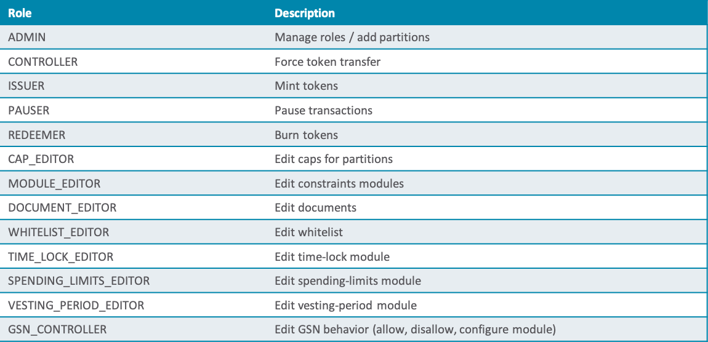
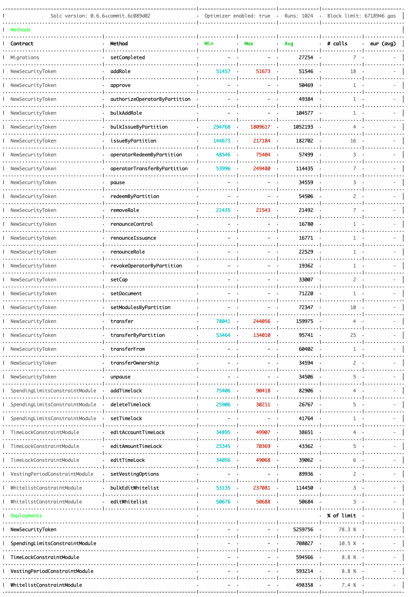

# micobo Security Token

## Intro

The **micobo Security Token** is an ERC20- and ERC1400-compatible, constrainable token developed by micobo GmbH. It's main features are:  
#
-  **ERC 20** compatible
#
- **ERC 1400** Partitions
#
- Customizable Transfer Constraints (Modules)
    - **Whitelist** for accounts
    - **Locking** periods for accounts and amounts
    - Time-based **spending limits**
    - **Vesting periods**
    - Off-chain validation (coming soon)
#
- **Controller operations** for compliace (force transfers etc., can be turned off)
#
- Very granular, customizable **roles management**
#
- Optional "free" transactions through [GSN](https://opengsn.org/) 
#
- **Bulk-minting**, -whitelisting and -addRoles
#
- Document Management
#


## Setup

1. Solidity

we use `solc` binary, for manual compilation, since `solcjs` npm module throws error ("File import callback not supported")

[Install the binary here](https://solidity.readthedocs.io/en/latest/installing-solidity.html)  
look for the brew installation

2. Truffle

You need truffle installed globally
#

## Deployment

Edit the `token-config.json` file to set token **name**, **symbol** and **cap** etc.

Use the deploy script to deploy all contracts on local testnet (localhost:8454):

    npm run deploy

#

## Architecture


#

## Constrainable

Constraint Modules can be set to implement any kind of on-chain checks.


These are constraints modules that already exist, but you can write your own,  
as long as the implement the `IConstraintModule.sol` interface!

I.e., the off-chain validation module checks for the signature of an offline validator in the transactions extra data.

#

## Administrable

Roles can be **added** and **removed** by the `ADMIN`

This is and overview of roles that can be used.  
**Additional roles can always be added after deployment!** (i.e. for new constraint modules)




#
## Free Transactions

**Gas Station Network (GSN)**


Using a relayer, you can pay for the transactions of your token users.

The GSN Module can be configured even after the token is deployed.

GSN can also be turned off completely!

#

# Explanations

## Cap

There is 1 overall cap for the whole token (`_cap`)

It is set during deployment in the constructor.

Get cap with `cap()`

When `CAP_EDITOR`, use `setCap(uint256 newCap)` to set to new value.  
The new cap must always be greater than the old one!

When using `issueByPartition` or `bulkIssueByPartition`,  
the issued value must not exceed `_cap`


## Admin

Admin is a role.
It controls assignment and removal of all roles.  
It can also assign and remove other admins.  
It cannot renounce itself, as this would leave the contract potentially without admin.


## Controller

Controllers is a role.
As every role, it can be assigned or removed by the admin role, as well as renounce itself.  
If the contract is `isControllable()`,  
Controllers can force-transfer tokens disregarding ownership and constraints using `operatorTransferByPartition`.  
In this case, the controller is regarded as a kind of master-operator.


## Operator

Operators can transfer tokens on behalf of users that authorized them to do so using `operatorTransferByPartition`.  
Users can authorize addresses to transfer tokens on their behalf on a "by partition"-basis.  
This authorization can be revoked at any time.

#
## RIVER Principle
`If not specified otherwise, tokens will always be transferred to the „base“(0)-partition!`

    This way, partitions containing locked or vesting tokens can not be changed afterwards.  
    
    Partitions are like token guardians: they hold on to your tokens using different constraint modules.  
    
    Once you can release them, they go into the „base“-partition where they can be transferred freely (or following the constraints defined there) from now on
#

### Compatibility

We partially implement ERC1400.  
We implement ERC20 using default partitions.  

We don't implement ERC777 functionality.

#
## Tests

All functionality of the smart contracts is tested in mulitple test classes found in the `/test` folder.

The tests are kept as atomic (specific) and autonomous as possible.  
Autonomy means that no test will fail or succeed dependant on the outcome of a different test.

-   Make sure the **solidity version** in `truffle-config.js` is the same as your contracts' pragma statement!

*   Also make sure that **Ganache** is running on port `:8545`

*   **GSN_Relayer**: If you test GSN functionality, also run the dev-relayer:
    ```
    npx oz-gsn run-relayer --ethereumNodeURL http://localhost:8545
    ```

Use the test script to run all tests:

    npm run test

#

## Gas report

Gas report is configured by default in `truffle-config.js`

It can be configured here:

    mocha: {
            reporter: 'eth-gas-reporter',
            reporterOptions: {
                currency: 'EUR',
                gasPrice: 2,
                url: 'http://localhost:8545',
            },
        },
    }
#

#

## Code Coverage

(Does not work when using 2 truffle configs, because of different solidity versions)

Stop your local blockchain and start the coverage plugin with:

    truffle run coverage --temp /build/solcover --network development

_(also run the GSN relayer if you don't want GSN tests to fail)_

For specific files, add

    --file="test/10_spendingLimitTests.js"

[solidity-coverage package on npm](https://www.npmjs.com/package/solidity-coverage#config-options)

#

#### Diagrams

All diagrams were made with the free software [draw.io](draw.io)  
Simply open the corresponding XML file in the editor and export into JPEG to update any diagram.
