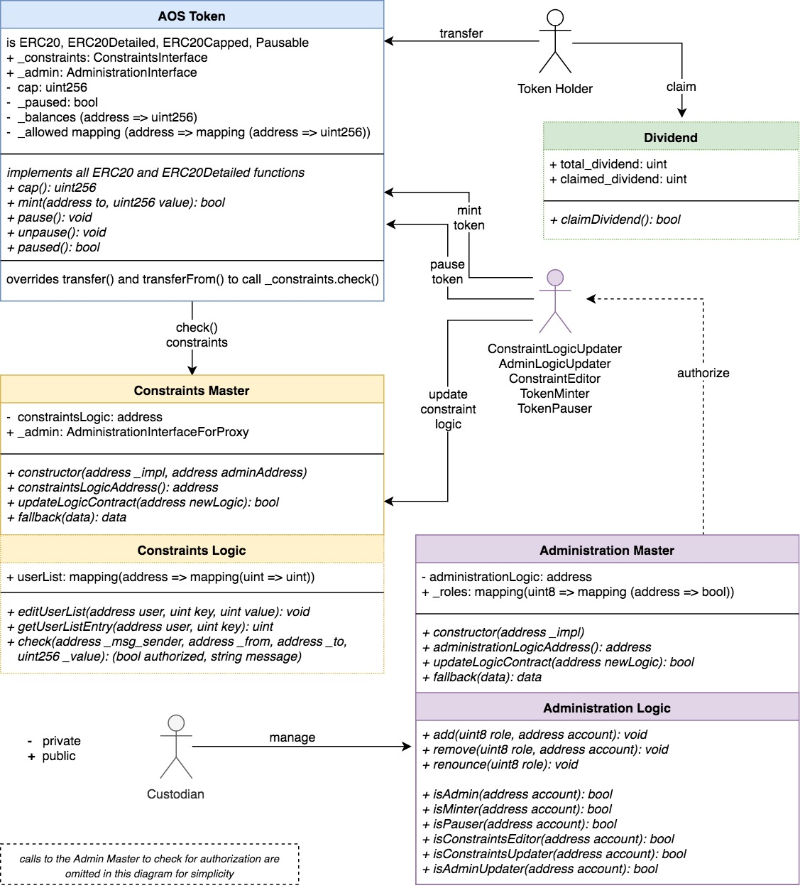

## Azhos Smart Contracts

### Components

There are 4 main components:

1. _AOS Token Contract_  
2. _Constraint Logic Contract_ (CLC)  
3. _Administration Logic Contract_ (ALC)
4. _Dividend Contract_         (DC)  


##

   CLC and ALC an will both be made **updatable** through the use of master contracts.  
   This means that their storage data will persist when new versions are deployed.

#
### Architecture




#

#### Administration Logic Contract

The Administration contract can endow addresses with one **Role** or more:

- ADMIN  
- ADMIN_UPDATER  
- CONSTRAINTS_UPDATER  
- MINTER  
- PAUSER  
- CONSTRAINTS_EDITOR 

#

#### Constraints Logic Contract

The Constraints Logic Contract checks constraints when tokens are transferred.  
Currently, we have checks implemented for _sending_ and _receiving_ tokens.  
These are reflected in the **Code** enum:  
  
- SEND  
- RECEIVE

#
### Updatable contracts

The contracts we call _logic_ contracts are treated as Solidity [_libraries_](https://solidity.readthedocs.io/en/latest/contracts.html?#libraries).  
This means that they are exclusively used to perform tasks for other contracts, in this case the _master_ contracts.  

Even though the master contract does not contain any of the variable definitions or functions,  
it assumes these as its own when using "delegatecall" to use our library/logic contract.  

So i.e. the _userList_ mapping is actually saved in the master contract's storage and we are using the logic contract's functions to alter it.

This gives us the ability to update the logic contract whenever we want!  

**But, the new contract has to inherit the old one**, so that the old storage variables will not be changed.


#
### Process Flows

We can identify these main interactions:  

**User Interaction**  
    1. transfer AOS token  
    2. claim dividend
 
**Updates**  
    3. update CLC   
    4. update ALC

**Admin**  
    5. edit roles  
    6. renounce role  
    7. edit userList (i.e. whitelist)  
    8. minting  
    9. pausing and unpausing
    

##
#### 1. transfer AOS token

Every token transferring action triggers a call to the _check()_ function in the CLC, which is routed through the master contract (here Master Contract)


##
#### 2. claim dividend

As a token holder, I can claim my fair share of the dividend.  
A call to determine the callers token balance (greyed out here) is not planned for now, but can easily be added later on.


##
#### 3. update constraints logic contract

Given the necessary authorisation, we can update the Constraints Logic Contract.  
We need to deploy the new version, which has to inherit the old one.  
We then register the new contract address with the master contract.


##
#### 4. update admin contract

The process is almost identical to the one showing the constraint logic contract update, so it is omitted here.

##
#### 5. edit roles

Roles can be edited only by the admin using
```
function add(uint8 role, address account) _onlyAdmins public
```
and
```
function remove(uint8 role, address account) _onlyAdmins public
```
which can be found in the admin contract

##
#### 6. renounce role

Every bearer of a role can renounce that role any time by calling
```
function renounce(uint8 role) public
```

##
#### 7. edit userList (whitelist)

An authorized actor can make changes in the userList mapping of the CLC.  
For example, an addition to the whitelist can be made by calling the 
```
editUserList(address user, uint key, uint value)
```
function in the CLC like this:

")

##
#### 8. minting

Only accounts bearing the role of **MINTER** can mint tokens using this function in the CompliantToken:
```
function mint(address to, uint256 value) external returns (bool);
```

##
#### 9. pausing and unpausing

Only accounts bearing the role of **PAUSER** can pause or unpause the token contract  
using these functions in the CompliantToken:
```
function pause() external;

function unpause() external;
```


#
### Contract descriptions
#### AOS Token
TODO


### Tests

All functionality of the smart contracts is tested in mulitple test classes found in the `/test` folder.  
The tests are kept completely as atomic (specific) and autonomous as possible.  
Autonomy means that no test will fail or succeed dependant on the outcome of a different test.

**To use truffle tests on your own testchain, change the** ``.test_mnemonic`` **file to containt your own mnemonic key!**  
Also make sure that your testnet is running on port ```:8545```


### Diagrams

All diagrams were made with the free software [draw.io](draw.io)  
Simply open the corresponding XML file in the editor and export into JPEG to update any diagram.


